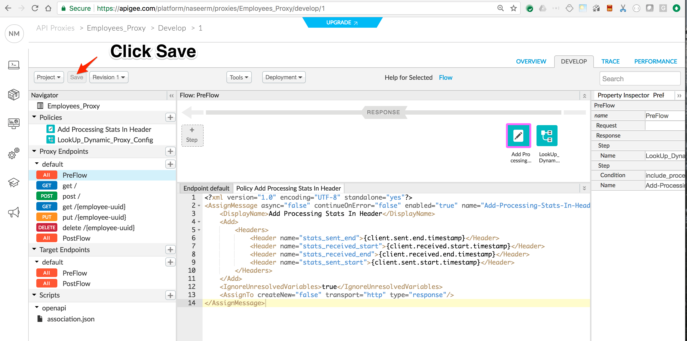
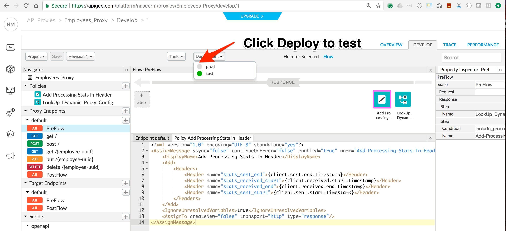
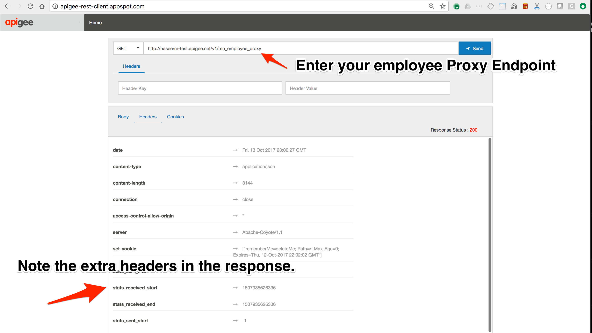

# KVM : Dynamic API Proxy Configuration 

*Duration : 30 mins*

*Persona : API Team*

# Use case

You want your API Proxy to dynamically toggle configuration, there by some of the policies of any API Proxy are executed only when certain conditions are met. 

# How can Apigee Edge help?

By leveraging Apigee Key Value Map Policy (KVM), attributes based on which dynamic configuration is derived can be managed at Apigee. KVM provides management APIs to manage the stored values. KVM along with the Apigee Conditional tags can be leveraged to add Dynamic processing nature to API Proxies.
 
# Pre-requisites

Apigee Edge API Proxy created in core lab exercise. If not, jump back to "API Design - Create a Reverse Proxy with OpenAPI specification" lab.

# Instructions

1. Go to [https://apigee.com/edge](https://apigee.com/edge) and log in. This is the Edge management UI. 

2. Select **Admin → Environments** in the side navigation menu.

3. Select **test** as your environment and select the **Key Value Map** tab.

4. Click New Key Value Map button to add a new Key Value Map.

5. Enter the Key Value Map name as __DynamicProxyConfig__.

6. Click New Key Value Map Entry button to add a new Key Value Map Entry.

7. Enter the Key name as __include_processing_stats_in_response__ and value as __ALL__. Click Save.

8. You have configured a KVM and added an attribute entry that will be used in the API Proxy to dynamically configure the amount of processing stats sent back along with Response. 

## API Proxy Configuration

1. Select the {your-initials}_Employees_Proxy API proxy that you created in the Core Labs.

2. Click on **Develop** tab of {your-initials}_Employees_Proxy API proxy.

3. Click on **+Step** of the response of PreFlow as shown in the image below.

3. Select the __KeyValueMapOperations__ Policy from menu in left. Enter the name of the Policy as __LookUp_Dynamic_Proxy_Config__ and Click **Add** button.

3. Similarly Click on **+Step** one more time and add __AssignMessage__ Policy. Enter the name as "Add Processing Stats In Header" and Click **Add** button.

4. Click on **Default** under Proxy Endpoint

5. Add a Conditional Statement on the "Add Processing Stats In Header" Policy.

5. Click on **Save** button.

5. Click on **Deploy** button, and deploy to test.

## Test the API policy configuration

1. Open the  [Apigee Rest Client](https://apigee-rest-client.appspot.com/)  and run the Employee Proxy URL.

2. TODO...

*Congratulations!*...You have added 

# Earn Extra-points

TODO

# Quiz

1. TODO

2. TODO

# Summary

TODO

# References

* Useful Apigee documentation links on Traffic Management & Spike Arrest Policy  - 

     

# Rate this lab

How did you like this lab? Rate [here](https://goo.gl/forms/oivm4A6DqBKM9AEJ3).

