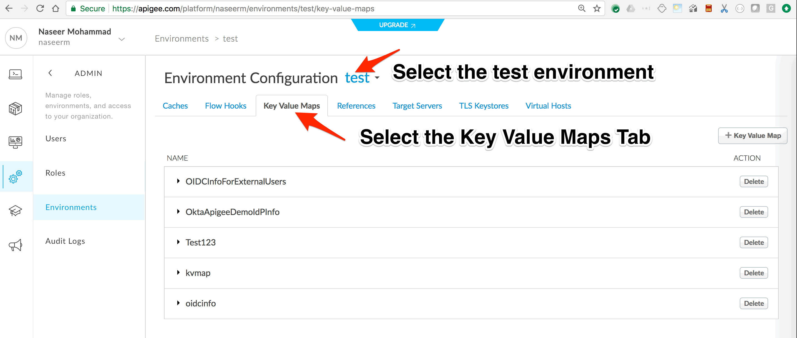

# KVM : Dynamic API Proxy Configuration 

*Duration : 30 mins*

*Persona : API Team*

# Use case

You want your API Proxy to dynamically toggle configuration, there by some of the policies of any API Proxy are executed only when certain conditions are met. 

# How can Apigee Edge help?

By leveraging Apigee Key Value Map Policy (KVM), attributes based on which dynamic configuration is derived can be managed at Apigee. KVM provides management APIs to manage the stored values. KVM along with the Apigee Conditional tags can be leveraged to add Dynamic processing nature to API Proxies.
 
# Pre-requisites

Apigee Edge API Proxy created in core lab exercise. If not, jump back to "API Design - Create a Reverse Proxy with OpenAPI specification" lab.

# Instructions

1. Go to [https://apigee.com/edge](https://apigee.com/edge) and log in. This is the Edge management UI. 

2. Select **Admin → Environments** in the side navigation menu.

3. Select **test** as your environment and select the **Key Value Map** tab.

4. Click New Key Value Map button to add a new Key Value Map.

5. Enter the Key Value Map name as __DynamicProxyConfig__.

6. Click New Key Value Map Entry button to add a new Key Value Map Entry.

7. Enter the Key name as __include_processing_stats_in_response__ and value as __ALL__. Click Save.

8. You have configured a KVM and added an attribute entry that will be used in the API Proxy to dynamically configure the amount of processing stats sent back along with Response. 

## API Proxy Configuration

1. Select the {your-initials}_Employees_Proxy API proxy that you created in the Core Labs.

2. Click on **Develop** tab of {your-initials}_Employees_Proxy API proxy.

3. Click on **+Step** of the response of PreFlow as shown in the image below.

3. Select the __KeyValueMapOperations__ Policy from menu in left. Enter the name of the Policy as __LookUp_Dynamic_Proxy_Config__ and Click **Add** button.

3. Similarly Click on **+Step** one more time and add __AssignMessage__ Policy. Enter the name as "Add Processing Stats In Header" and Click **Add** button.

4. Click on **Default** under Proxy Endpoint

5. Add a Conditional Statement on the "Add Processing Stats In Header" Policy.

5. Click on **Save** buton.

5. Click on **Deploy** buton, and deploy to test.

Think of Spike Arrest as a way to generally protect against traffic spikes rather than as a way to limit traffic to a specific number of requests. Your APIs and backend can handle a certain amount of traffic, and the Spike Arrest policy helps you smooth traffic to the general amounts you want.

The runtime Spike Arrest behavior differs from what you might expect to see from the literal per-minute or per-second values you enter.

For example, say you enter a rate of 6pm (6 requests per minute). In testing, you might think you could send 6 requests in 1 second, as long as they came within a minute. But that's not how the policy enforces the setting. If you think about it, 6 requests inside a 1-second period could be considered a mini spike in some environments.

What actually happens, then? To prevent spike-like behavior, Spike Arrest smooths the number of full requests allowed by dividing your settings into smaller intervals:

* **Per-minute** rates get smoothed into full requests allowed in intervals of **seconds**. For example, 6pm gets smoothed like this: 60 seconds (1 minute) / 6pm = 10-second intervals, or 1 request allowed every 10 seconds. A second request inside of 10 seconds will fail. Also, a 7th request within a minute will fail.

* **Per-second** rates get smoothed into full requests allowed in intervals of **milliseconds**. For example, 10ps gets smoothed like this: 1000 milliseconds (1 second) / 10ps = 100-millisecond intervals, or 1 request allowed every 100 milliseconds. A second request inside of 100ms will fail. Also, an 11th request within a second will fail.

9. Click on **Save** to save the API Proxy changes.

*Congratulations!*...You have now secured your backend against denial of service attacks, performance lags or downtime of target servers.

## Test the API policy configuration

1. Let us test the updated API proxy using the Trace Console. Click on **Trace** tab.

2. Click on **Start Trace Session** to see API Proxy with spike arrest in action.

3. Click on **Send** button multiple times, You will see 500 response code when spike arrest policy kicks in to protect target servers from spike in traffic.

4. You might notice that number of requests with 200 response is more than spike arrest rate value configured, It’s due to multiple message processors where policies gets executed and each has individual counters.

5. You can also use [Apigee Rest Client](https://apigee-rest-client.appspot.com/) to test Spike Arrest Policy.

# Lab Video

If you like to learn by watching, here is a short video on using Spike Arrest policy. [https://youtu.be/3Gi-GGTqllg](https://youtu.be/3Gi-GGTqllg)

# Earn Extra-points

Now that you have protected your backend against spike in traffic, Explore more about spike arrest policy using docs here, [http://docs.apigee.com/api-services/reference/spike-arrest-policy](http://docs.apigee.com/api-services/reference/spike-arrest-policy) & update the policy with identifer like queryparam on which spike arrest counter is updated. Use message weight property to assign a weight to the counter.

# Quiz

1. Assume there is a single message processor, Spike Arrest rate limit is 2 pm, What is the interval of time in which a single API Request is allowed to reach target server ?

2. Is it possible to implement spike arrest based on run time variables like per developer / per app ?

# Summary

That completes this hands-on lesson. In this simple lab you learned how to protect target servers against denial of service attacks.

# References

* Useful Apigee documentation links on Traffic Management & Spike Arrest Policy  - 

    * Spike Arrest Policy - http://docs.apigee.com/api-services/reference/spike-arrest-policy

    * Rate Limiting - [http://docs.apigee.com/api-services/content/rate-limiting](http://docs.apigee.com/api-services/content/rate-limiting)

    * Comparing Rate Limiting Policies - [http://docs.apigee.com/api-services/content/comparing-quota-spike-arrest-and-concurrent-rate-limit-policies](http://docs.apigee.com/api-services/content/comparing-quota-spike-arrest-and-concurrent-rate-limit-policies) 

# Rate this lab

How did you like this lab? Rate [here](https://goo.gl/forms/oivm4A6DqBKM9AEJ3).

Now go to [Lab-3](https://github.com/apigee/devjam3/tree/master/Labs/Core/Lab%203%20API%20Diagnostics%20-%20Trace%20tool)
